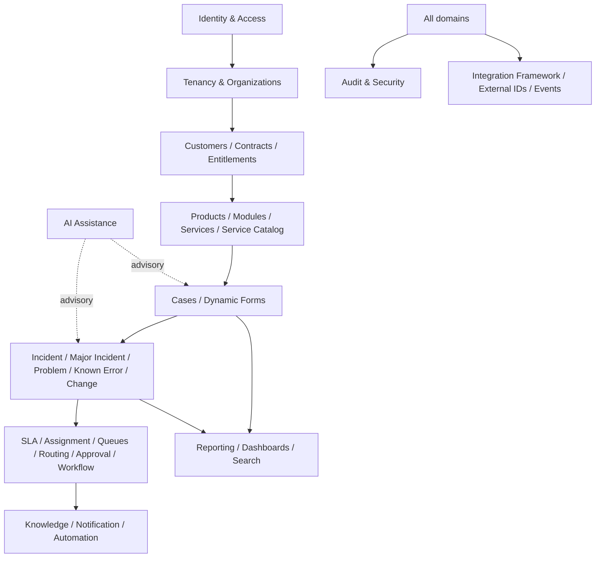

# C-Service Hub — Domain Map

## Context map

## Bounded contexts

| Context | Owns | Primary relationships |
|---|---|---|
| Identity & Access | Users, identities, sessions, MFA, roles, permissions, emergency access | Supplies principal context to every module |
| Tenancy & Organization | Tenants, organizations, government hierarchy, support hierarchy, scopes | Defines isolation and ownership boundaries |
| Customer & Commercial | Customers, contracts, entitlements, products, modules | Determines who can request which service |
| Service Catalog | Services, request types, dynamic forms, catalog publication | Creates case intake definitions |
| Case Management | Cases, comments, status, priority, relations, customer/internal visibility | Central operational record |
| Incident Operations | Incidents, major incidents, problems, known errors, changes | Extends case lifecycle with ITSM governance |
| Work Orchestration | Queues, assignment, skills, routing, workflow, approvals, SLA | Determines next action and timing |
| Knowledge & Communication | Articles, announcements, notifications, templates, preferences | Provides self-service and outbound communication |
| Automation & Integration | Rules, webhooks, external IDs, email-to-case, event handling | Connects platform to ecosystem |
| Audit, Security & Compliance | Audit events, classification, retention, access reviews | Cross-cutting control plane |
| Search & Reporting | Indexes, saved searches, reports, dashboards, exports | Read-optimized operational insights |
| AI Assistance | Summaries, classification, suggestions, retrieval context | Advisory only; never bypasses authorization |

## Core aggregate relationships

A `Tenant` owns `Organization`, `UserMembership`, `Service`, `Queue`, `Case`, `Contract`, `Entitlement`, `Workflow`, and `Policy` records. An `Organization` may have parent/child relationships and support hierarchy metadata. A `Customer` belongs to a tenant and may be linked to one or more organizations.

A `Case` references a tenant, requester, affected organization, service, request type, queue, assignee, SLA policy, and optional parent/related case. Incident, problem, known-error, and change records should extend or relate to Case rather than duplicate customer and communication concepts.

A `Workflow` is tenant-scoped and versioned. It contains nodes, transitions, conditions, actions, approvals, and publication metadata. A `WorkflowRun` records execution state and emitted audit/event references. A `SLAInstance` attaches a policy snapshot to a case and records timers, pauses, breaches, and escalations.

An `Attachment` belongs to a tenant and a domain resource, carries security classification, scan state, content metadata, and uploader actor. Its download path must always be authorized at request time.

## Cross-cutting invariants

1. Every tenant-owned resource is isolated by tenant context and never selected by an unscoped repository method.
2. Organization hierarchy is evaluated before exposing customer, case, report, or knowledge data.
3. Internal status and customer-facing status are distinct projections.
4. AI output is advisory and must preserve source references and actor accountability.
5. Domain mutations emit auditable events and, where needed, outbox events.
6. Published configuration is immutable; updates create a new version.
7. Soft-deleted records remain unavailable to normal reads but remain discoverable to authorized audit/retention processes.
8. Localized labels are keys and translations, never business-rule identifiers.

## Initial implementation order

Start with Identity/Tenancy context, then Customer/Organization and Service Catalog read models, then Case Management read/write paths. Add Work Orchestration and SLA after a stable case lifecycle exists. Add Incident/Problem/Change, Knowledge/Notification, Automation/Integration, Reporting/Search, and AI as bounded increments.
