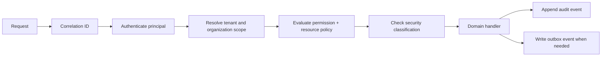

# C-Service Hub — Security Model

**Status:** Phase 1 security baseline; enforcement is not implemented in the static preview.

## Security objectives

The platform must prevent cross-tenant data exposure, unauthorized organization access, privilege escalation, unsafe automation, and untraceable administrative changes. Arabic/English support must not change authorization decisions; locale affects presentation and message keys only.

## Request authorization pipeline

A handler must never infer tenant identity from a user-supplied resource alone. Tenant and organization scope come from trusted request context. Repositories require that context and include scope predicates in every query. Permission checks happen before returning resource existence details.

## Authorization model

Use RBAC for stable capabilities such as `cases.read`, `cases.update`, `workflow.publish`, and `audit.read`. Add resource and hierarchy policies for organization scope, customer visibility, government support hierarchy, classification, and relationship-based access. Deny by default. UI visibility is only a usability feature; the server remains the enforcement point.

The `client/src/platform/tenant.ts` helpers provide a small, testable contract for preview adapters. They are not a security boundary and must not be used as a replacement for server authorization.

## Sensitive operations

Impersonation, emergency access, role changes, tenant configuration, workflow publication, data exports, attachment downloads, and retention actions require elevated permissions, explicit reason where applicable, time limits, and immutable audit events. Emergency access must trigger notification and post-event review.

## Data protection

Classify data as public, internal, confidential, or restricted. Store classification on resources and attachments, enforce it in search and downloads, and redact restricted values from logs and AI prompts. Secrets must come from managed environment configuration, never source control. Attachments require malware scanning, size/type validation, authorization on every download, and signed short-lived URLs.

## Audit and monitoring

Record actor, tenant, organization scope, action, resource type/id, request ID, timestamp, outcome, reason, and relevant before/after references without storing unnecessary sensitive payloads. Emit structured logs, authentication failures, permission denials, tenant-scope violations, export activity, workflow runs, integration failures, and SLA processing health. Preserve correlation IDs across outbox workers and external callbacks.

## Threats to address in foundation implementation

- Missing tenant predicate or confused-deputy access through integrations.
- IDOR through case, attachment, report, or workflow URLs.
- Stale role or membership claims after revocation.
- Replay or duplicate delivery of webhooks and workflow actions.
- Unsafe file upload and malicious document content.
- Sensitive data leakage through logs, search indexes, reports, or AI prompts.
- Privilege escalation through workflow actions or impersonation.
- Unbounded list/export endpoints and rate-limit bypass.
- Localization or mixed-direction rendering used to obscure audit content.
